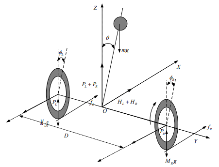
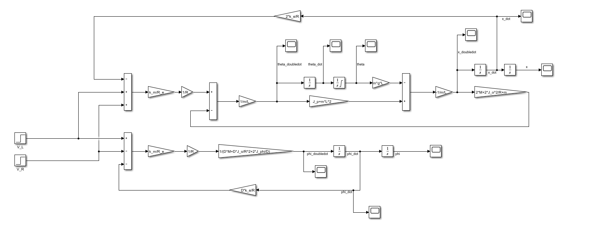
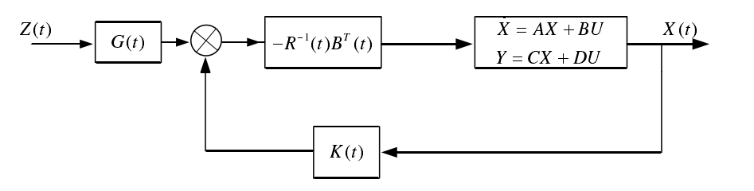
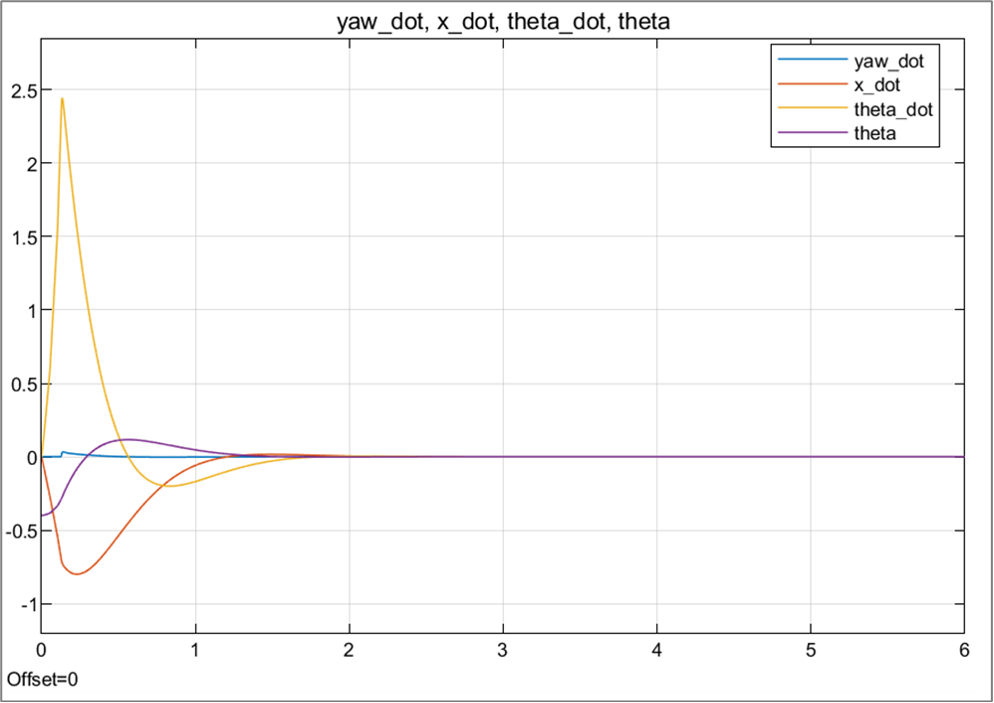

# Mechatronics-Course-Project-Spring-2022
This is a repository of course materials of Mechatronics (Spring 2022)  
## Physical Model  
  
## Simulink Model  
  
## Linear Quadratic Regulator  
  
## Response  

